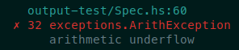
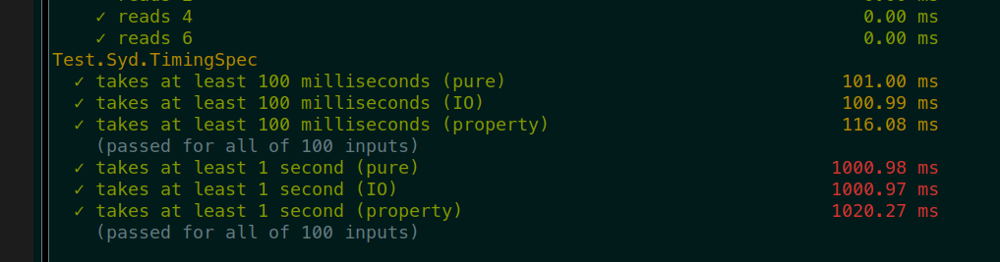
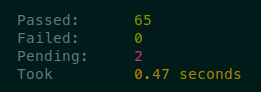
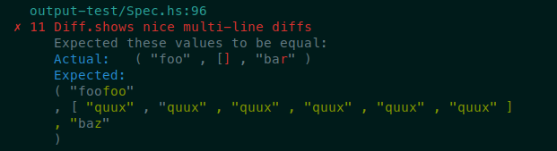
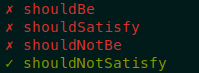
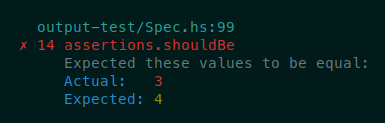
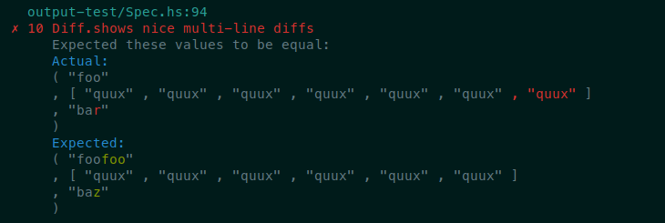
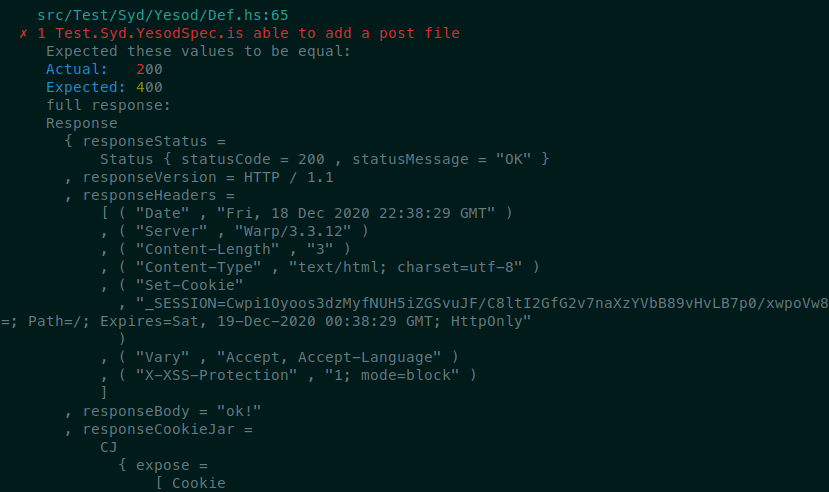
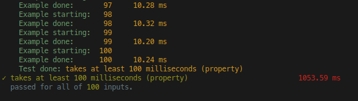

# sydtest

A modern testing framework for Haskell with good defaults and advanced testing features.


## License

Copyright (c) 2020-2022 Tom Sydney Kerckhove

All Rights Reserved

See [LICENSE](./sydtest/LICENSE.md)

## Contributing

See [the contribution guide](./CONTRIBUTING.md)

## In short

This is a short overview of the principles by which sydtest was designed.
See a complete overview of the features below.

### Principle: Passing tests should give you confidence

This means you should be alerted of any potential issue as early as possible.

* Parallel test execution by default

  This will show any race-conditions or lack of thread-safety that your code may have.
  It also helps with decreasing the total runtime of a test suite.

* Randomised test suite execution order by default

  This will prevent any dependency on the order of execution.

### Principle: Reproducible tests

* Deterministic randomness by default

  Both the test suite execution order shuffling and the property testing randomness uses a fixed seed by default.
  This helps to prevent flakiness and makes it easy to reproduce a failing test.

* Flakiness diagnosis
  
  When you notice a flaky test suite, sydtest offers you tools to help diagnose this flakiness.
  This turns a flaky test suite into a reproducible failure that you can go and fix.

### Principle: Debugging should be as easy as possible

* Pretty show for output
  
  Sydtest uses [`ppShow`](http://hackage.haskell.org/package/pretty-show-1.10/docs/Text-Show-Pretty.html#v:ppShow) to show values in test failure output.
  This makes it easier to investigate the failure.

* Multi-line coloured diffs

  When values are asserted to be equal, the diff is shown on multiple lines and it is coloured to help with investigating.

* Contextual failures
  
  Sydtest allows you to attach context to assertions to show more output than just the assertion-specific output when the assertion fails.

* Named predicates

  Whenever you use a custom predicate in an assertion, you get the opportunity to annotate it with its name so that when the test fails, you see _which_ predicate failed.
  The output also mentions explicitly whether the predicate was supposed to pass or fail.

* Automatic flakiness diagnostics

  Sydtest will try to find out whether a test is flaky as soon as one fails.
  The test will still be considered "failed", but you get the extra information about whether it is flaky.

### Principle: Suitable for CI

* Bounded shrinking by default

  While QuickCheck uses unbounded shrinking by default, sydtest overrides this to provide bounded shrinking by default.
  This helps to prevent any infinite hangs when a counterexample is found.

* Timing tests and test suites

  Sydtest shows how long tests took (with colour coding) to help you speed up your test suite most effectively.
  It also shows you if the slowest test took a significant part of the total runtime of your test suite.

### Principle: Advanced testing features

* Resource setup
  
  Sydtest helps you to set up resources during test suite execution.
  It offers combinators that did not exist before, like `aroundAll`, as well as the powerful `SetupFunc` concept.

* Built-in golden tests with good diffing.

### Principle: Batteries included

This repository contains many companion libraries to write integration tests with popular dependencies:

- RabbitMQ: `sydtest-amqp` and `sydtest-rabbitmq`
- Redis: `sydtest-hedis`
- Mongo: `sydtest-mongo`
- Postgres: `sydtest-persistent-postgresql`
- Sqlite: `sydtest-persistent-sqlite`
- Wai: `sydtest-wai`
- Servant: `sydtest-servant`
- Yesod `sydtest-yesod`

## Features & Comparison to similar projects

|                                                                                           | sydtest | Hspec                                                       | Tasty                                                            |
|-------------------------------------------------------------------------------------------|---------|-------------------------------------------------------------|------------------------------------------------------------------|
| Declarative test definition                                                               | ✔️       | ✔️                                                           | ✔️                                                                |
| Monadic test definition                                                                   | ✔️       | ✔️                                                           | ✔️                                                                |
| Safe test execution                                                                       | ✔️       | ✔️                                                           | ✔️                                                                |
| Parallel test execution                                                                   | ✔️       | ✔️                                                           | ✔️                                                                |
| Parallel or sequential test-group execution                                               | ✔️       | ✔️                                                           | ✔️                                                                |
| Automatic test discovery [1]                                                              | ✔️       | ✔️                                                           | ✔️                                                                |
| Automatic test discovery with shared resources                                            | ✔️       | [✖](https://github.com/hspec/hspec/issues/404)              | ?                                                                |
| First-class support for pure tests                                                        | ✔️       | ✔️                                                           | C                                                                |
| First-class support for integration tests                                                 | ✔️       | ✔️                                                           | [Lib](https://hackage.haskell.org/package/tasty-hunit)           |    
| First-class support for property tests with QuickCheck                                    | ✔️       | ✔️                                                           | [Lib](https://hackage.haskell.org/package/tasty-quickcheck)      |
| First-class support for property tests with Hedgehog                                      | ✔️       | [Lib](https://hackage.haskell.org/package/hspec-hedgehog)   | [Lib](https://hackage.haskell.org/package/tasty-hedgehog)        |
| First-class support for property tests with Smallcheck                                    | 🚧      | [Lib](https://hackage.haskell.org/package/hspec-smallcheck) | [Lib](https://hackage.haskell.org/package/tasty-smallcheck)      |
| First-class support for golden tests                                                      | ✔️       | [Lib](https://hackage.haskell.org/package/hspec-golden)     | [Lib](https://hackage.haskell.org/package/tasty-golden)          |
| Source location annotations for tests in test output                                      | ✔️       | ✔️                                                           | Lib [3]                                                          |
| Test suite filtering to select which tests to run                                         | ✔️       | ✔️                                                           | ✔️                                                                |
| Individual test execution timing                                                          | ✔️       | ✔️                                                           | [Lib](https://hackage.haskell.org/package/tasty-stats)           |
| Test suite execution timing                                                               | ✔️       | ✔️                                                           | ✔️                                                                |
| Helpful output to find slow tests                                                         | ✔️       | ✔️                                                           | C                                                                |
| Coloured output                                                                           | ✔️       | ✔️                                                           | ✔️                                                                |
| Colourless output                                                                         | ✔️       | ✔️                                                           | ✔️                                                                |
| `ppShow` instead of `show` for counterexample output                                      | ✔️       | ✖️                                                           | [Lib](https://hackage.haskell.org/package/tasty-hedgehog)        |
| `show` for counterexample output                                                          | 🚧      | ✔️                                                           | [Lib](https://hackage.haskell.org/package/tasty-hunit)           |
| Fancy Unicode output                                                                      | ✔️       | ✔️                                                           | C                                                                |
| Unicode-free output                                                                       | 🚧      | ✔️                                                           | ✔️                                                                |
| Assertion-specific output with explanation                                                | ✔️       | ✔️                                                           | [Lib](https://hackage.haskell.org/package/tasty-hedgehog)        |
| Coloured diffing                                                                          | ✔️       | ✔️                                                           | C                                                                |
| multi-line diffing                                                                        | ✔️       | ✖️                                                           | ✖️                                                                |
| Contextual failures                                                                       | ✔️       | ✖️                                                           | ✖️                                                                |
| Named predicates                                                                          | ✔️       | ✖️                                                           | ?                                                                |
| Inter-test progress output during test suite execution                                    | ✔️       | ✔️                                                           | ✔️                                                                |
| Intra-test progress output during test suite execution                                    | ✔️       | ✔️                                                           | [Lib](https://hackage.haskell.org/package/tasty-quickcheck)      |
| Optional standard output and standard error suppression [2]                               | ✖️       | ✖️                                                           | ✖️                                                                |
| Acquire and release a resource for every test in a group (`before` and `after`)            | ✔️       | ✔️                                                           | C                                                                |
| Acquire and release a resource once for an entire test group (`beforeAll` and `afterAll`)  | ✔️       | ✔️                                                           | ✔️                                                                |
| Wrap a single test to use a `withResource`-like function (`around`)                       | ✔️       | ✔️                                                           | ✖️                                                                |
| Wrap a test group to use a `withResource`-like function (`aroundAll`)                     | ✔️       | ✔️[4]                                                           | ✖️                                                                |
| Randomising execution order                                                               | ✔️       | ✔️                                                           | C                                                                |
| Randomised execution order by default                                                     | ✔️       | ✖️                                                           | C                                                                |
| Deterministic randomness for randomised execution                                         | ✔️       | ✔️                                                           | C                                                                |
| Deterministic randomness for randomised execution order by default                        | ✔️       | ✖️                                                           | C                                                                |
| Deterministic randomness                                                                  | ✔️       | ✔️                                                           | ✔️                                                                |
| Deterministic randomness by default                                                       | ✔️       | ✖️                                                           | ✖️                                                                |
| Deterministic randomness instructions for rerunning tests                                 | ✔️       | ✔️                                                           | C                                                                |
| Hiding process arguments from tests                                                       | ✔️       | ✔️                                                           | C                                                                |
| Declaring that an individual test should fail                                             | 🚧      | ✖️                                                           | [Lib](http://hackage.haskell.org/package/tasty-expected-failure) |
| Declaring that at least one in a test group should fail                                   | 🚧      | C                                                           | [Lib](http://hackage.haskell.org/package/tasty-expected-failure) |
| Using scarce resources across tests                                                       | 🚧      | C                                                           | C                                                                |
| A way to fail the test suite as soon as one test fails (`--fail-fast`)                    | ✔️       | ✔️                                                           | ?                                                                |
| Fully configurable via flags                                                              | ✔️       | ✔️                                                           | ✔️                                                                |
| Fully configurable via environment variables                                              | ✔️       | ✔️                                                           | ✔️                                                                |
| Fully configurable via configuration file                                                 | ✔️       | ✔️                                                           | ✖️                                                                |
| Pending tests                                                                             | ✔️       | ✔️                                                           | ✖️                                                                |
| Iterative testing to diagnose flakiness                                                   | ✔️       | ✖️                                                           | ?                                                                |
| Automatic flakiness diagnostics                                                           | ✔️       | ?                                                           | ?                                                                |
| Flakiness combinators to practically deal with flakiness                                  | ✔️       | ?                                                           | ?                                                                |

* ✔️: Supported 
* Lib: Possible with an extra library
* C: Possible but you have to write some code yourself
* 🚧 — Under development
* ✖️: Not supported
* ?: I don't know.

Please let me know if I made a mistake anywhere, and feel free to fill in the question marks

* [1]: Test discovery is always handled via a separate library so I use `✔️` instead of `Lib`.
* [2]: It turns out that this is surprisingly difficult, due to [forkProcess' interaction with `MVar`s](https://www.reddit.com/r/haskell/comments/jsap9r/how_dangerous_is_forkprocess/) but I'm still looking for a way to make it happen. The answer may lie in [the way `weigh` does it](https://github.com/fpco/weigh/blob/bfcf4415144d7d2817dfcb91b6f9a6dfd7236de7/src/Weigh.hs#L373)
* [3]: This is not a responsibility of Tasty, it is a responsibility of test providers. tasty-hedgehog for example preserves all the nice formatting you get from Hedgehog.
* [4]: [`aroundAll` is available in `hspec` as of `hspec-2.7.8`](http://hackage.haskell.org/package/hspec-2.7.8).


## Migrating from `hspec`

Migrating from `hspec` to `sydtest` has been made relatively easy.
In most cases, the following should suffice:

```
find */test -name "*.hs" -exec sed -i 's/Test.Hspec/Test.Syd/g' {} +
find */test -name "*.hs" -exec sed -i 's/hspec-discover/sydtest-discover/g' {} +
find * -name "package.yaml" -exec sed -i 's/hspec/sydtest/g' {} +
find */test -name "*.hs" -exec sed -i 's/Test.Validity/Test.Syd.Validity/g' {} +
find */test -name "*.hs" -exec sed -i 's/import Test.Syd.QuickCheck//g' {} +
find */test -name "*.hs" -exec sed -i 's/Test.Syd.Validity.Optics/Test.Syd.Validity.Lens/g' {} +
find */test -name "*.hs" -exec sed -i 's/Yesod.Test/Test.Syd.Yesod/g' {} +
find * -name "package.yaml" -exec sed -i 's/yesod-test/sydtest-yesod/g' {} +
```

If you are using `hspec-discover`, the following change is to be made in your test entrypoint:

``` diff
-{-# OPTIONS_GHC -F -pgmF hspec-discover #-}
+{-# OPTIONS_GHC -F -pgmF sydtest-discover #-}
```

You can also use `sydtest-hspec` to import a hspec test suite into a sydtest test suite:

``` haskell
Test.Syd.Hspec.fromHspec :: Hspec.Spec -> Syd.Spec
```

### Pending tests

Pending tests are only a little less easy to migrate.

`hspec`:
``` haskell
it "works" pending
```

`sydtest`:
``` haskell
pending "works"
```

### `context`

The `context` function is a completely different function from the function with the same name in hspec.
In hspec, context is a synonym for describe, but in sydtest, context is used for contextual failures.
To migrate, replace your occurrences of `context` by `describe`.

### `beforeAll` and `afterAll`

The `*All` resource functions from hspec will still work, but inside them you
will need to use `itWithOuter` instead of `it`.

## Features in detail

### Declarative test definition

Tests are declared as follows:

``` haskell
spec :: Spec
spec = do
  describe "(+)" $ do -- description of which functions you are testing
    it "does what you want it to" $ -- sentence to describe what you expect to happen
      2 + 3 == 5 -- Test code
```

### Monadic test definition

You can use IO actions to help define tests:

``` haskell
spec :: Spec
spec = do
  (a, b) <- runIO whichNumbersToTest 
  describe "myFunction" $
    it "does what you want it to" $ -- sentence to describe what you expect to happen
      myFunction a b
```

### Safe test execution

Code that throws exceptions can be tested without trouble:

``` haskell
spec :: Spec
spec = do
  describe "pred" $ do
    it "throws no exceptions" $
      pred (0 :: Word) -- causes overflow (below zero), so this test will fail.
```

This test will fail, but the test suite will continue to be executed.

### Parallel test execution

Tests are executed with as many threads as you have capabilities by default.
You can use `-j` or `--jobs` to set the number of threads to use or `--synchronous` to run synchronously.

### Parallel or sequential test-group execution

You can specify, as part of the test suite definition, whether tests in a given test group are allowed to be run in parallel with other tests.
You can use the `parallel` combinator to declare that tests may be run in parallel.
You can use the `sequential` combinator to declare that tests must be run sequentially.
When using `sequential`, it is guaranteed that each test in the group will be the only one running during its execution.

### Automatic test discovery

The `sydtest-discover` tool can discover and consolidate your tests.

In order to use it, give the `Spec.hs` entrypoint for your test suite the following contents:

``` haskell
{-# OPTIONS_GHC -F -pgmF sydtest-discover #-}
```

You can also only generate a top-level `spec :: Spec` and write the main function yourself like this:

``` haskell
{-# OPTIONS_GHC -F -pgmF sydtest-discover -optF --no-main #-}
```

### Automatic test discovery with shared resources

The `sydtest-discover` tool does not care about whether the specs it discovers use resources, as long as they all use the same resources.
This means that if you use the same outer resource in your entire test suite, it only needs to be spawned once for the entire test suite, instead of once per module.

For example, you could use this `Spec.hs` file to discover `spec`s but not generate a main function:

``` haskell
{-# OPTIONS_GHC -F -pgmF sydtest-discover -optF --no-main #-}
```

Then you can write your own main module to spawn the outer resource:

``` haskell
module Main where

import Spec (spec)
import Test.Syd
import Test.Syd.Webdriver

main :: IO ()
main = sydTest $ webdriverSpec spec
```


### First-class support for pure tests

Any `Bool` value is considered a test.

``` haskell
spec :: Spec
spec = 
  describe "True" $
    it "is True" $ True
```

### First-class support for integration tests

Any `IO ()` value is considered a test.

``` haskell
spec :: Spec
spec = 
  describe "main" $
    it "does not crash" $ (main :: IO ())
```

### First-class support for property tests with QuickCheck

Any `Test.QuickCheck.Property` value is considered a test.

``` haskell
spec :: Spec
spec = 
  describe "reverse" $
    specify "reversing twice is the same as not reversing" $ 
      property $ \ls ->
        reverse (reverse ls) `shouldBe` ls
```

### First-class support for property tests with Hedgehog

Any `Hedgehog.Property` value is considered a test.

``` haskell
spec :: Spec
spec = 
  describe "reverse" $
    specify "reversing twice is the same as not reversing" $ 
      property $ do
        xs <- forAll $ Gen.list (Range.linear 0 100) Gen.alpha
        reverse (reverse xs) === xs
```

### First-class support for golden tests

Golden tests are a core feature of Sydtest.
Golden output is created automatically if none is found.
You can use `--golden-reset` to reset golden tests if they fail.

### Test suite filtering to select which tests to run

Every test failure is annotated with a source location of the test code that produced it.



### Test Suite Filtering

Test suites can be filtered using the `--match` or `--filter` flags.
Empty groups are removed so that their resources are not even set up when there are no tests that need them.

Examples:
```
stack test --test-arguments="--match MyTest"
cabal test --test-option="--match MyTest"
```

### Individual test execution timing and helpful output to find slow tests

Every test is timed and the execution (wall clock) time is shown at the right-hand side of the output.
The timing information is shown in such a way that it is easily compared: All in milliseconds and with the periods aligned.
It is also colour-coded so that slow tests really stick out in the report.



### Test suite execution timing

Every test suite comes with a short summary that includes how long it took to run the tests.



### Coloured output

The results report is nice and colourful.
See the screenshots in this file.
You can use `--no-colour` to turn off colours.

### Pretty show

Output uses `ppShow` from the `pretty-show` instead of the regular `show` so that output looks nicer and uses multiple lines.



### Fancy Unicode output

Tests are annotated with a nice unicode checkmark.



### Assertion-specific output

The `Test.Syd.Expectation` module contains common assertions like `shouldBe` and `shouldSatisfy`.
The `sydtest` framework knows about these and shows nice output when they fail.



### Multi-line coloured diffing

When two values are expected to be equal, the differences are shown in colour, across multiple lines, in linear time.



### Contextual failures

When a test fails, the failure can contain a context.
This way you can see a nice diff, but also any additional data that you may want to see.



This is specifically helpful when you compare multiple values to the same expected value:

```
it "are both 5" $ 
  thing1 `shouldBe` 5
  thing2 `shouldBe` 5
```

If you now see a failure like this:

```
Actual: 6
Expected: 5
```

... then you don't know which one was not 5.

With `sydtest` you can write that test with contexts:

```
it "are both 5" $
  context "thing1" $ thing1 `shouldBe` 5
  context "thing2" $ thing2 `shouldBe` 5
```

and see a failure like this:

```
Actual: 6
Expected: 5
thing2
```

### Inter-test progress output during test suite execution

The test suite report is printed bit by bit, after every test run.

### Intra-test progress output during test suite execution

To diagnose misbehaving tests, you can turn on `--progress` (or do the same via `--debug`).
This lets you investigate which part of the test is executing: Generation, shrinking, or execution, and the number of the example this is happening for along with its timing.



### The `before`, `after` and `around` combinators

You can acquire resources for use, every time, around every test in a group, see the `Test.Syd.Def.Around` module for more details:

``` haskell
spec :: Spec
spec = around withMyServer $ 
  it "does not crash" $ \_ -> (pure () :: IO ())
  it "returns 200 OK for the home" $ \cenv -> getHome cenv `shouldBe` 200

withMyServer :: (ClientEnv -> IO ()) -> IO ()
withMyServer = undefined

getHome :: ClientEnv -> IO Int
getHome = undefined
```

### The `beforeAll`, `afterAll` and `aroundAll` combinators

You can acquire resources for use, once, around all tests in a group, see the `Test.Syd.Def.AroundAll` module for more details:

``` haskell
spec :: Spec
spec = aroundAll withMyServer $ 
  itWithOuter "does not crash" $ \_ -> (pure () :: IO ())
  itWithOuter "returns 200 OK for the home" $ \cenv -> getHome cenv `shouldBe` 200

withMyServer :: (ClientEnv -> IO ()) -> IO ()
withMyServer = undefined

getHome :: ClientEnv -> IO Int
getHome = undefined
```

### Randomised execution order

The execution order of tests is randomised by default.
This randomisation uses deterministic randomness based on the same seed that is used for deterministic randomness.
This ensures that there are no inter-test ordering dependencies.

You can control whether subsections of your test suite may be randomised using the `randomiseExecutionOrder` and `doNotRandomiseExecutionOrder` combinators.
You can also turn this randomisation off globally using `--no-randomise-execution-order`.

Randomisation happens at the test group level. The ordering of the tests within a test group is randomised and the ordering of test groups is randomised, but the ordering is not randomised _across_ test groups.
This is because resource setups happen at the test group level, and we don't want multiple resource setups to happen concurrently if they were not meant to.


### Deterministic randomness

Property tests are executed with a fixed seed by default, to prevent flakiness.
You can change the seed using the `--seed` option.


### Hiding process arguments from tests

The process arguments are hidden during test suite execution (but not during definition) using `withArgs` so that tests cannot depend on command-line arguments.


### Fast failures

By default, tests run until completion.
With the `--fail-fast` flag, the tests will stop executing as soon as a failure occurs.
When using the asynchronous runner, it could be that multiple failures have already occurred between the first failure and the cancelling of the other tests.
In that case all of those failures are reported.


### Configurable in three ways

You can configure a test suite using flags, environment variables and configuration files.
Try running your test suite with `--help` to see how that works.

### Pending tests

You can declare that some tests are still missing like so:

``` haskell
spec :: Spec
spec = do
  describe "myFunction" $ do
    pending "has no tests yet"
    pendingWith "has no tests yet" "because, frankly, we don't care"
```

### Iterative testing to diagnose flakiness

To see if a test suite may be flaky, you can run it multiple times (with different, but still deterministic, randomness for each run) to diagnose the flakiness.
You can use `--iterations 10` to run a test suite up to 10 times, or `--continuous` to run it over and over until failure.

### Automatic flakiness diagnostics

Whenever a test fails, Sydtest will rerun it to see if it is flaky.
A test will be considered flaky if the test passed at least once, but will still be considered "failing".

TODO example output

### Flakiness combinators to practically deal with flakiness

You can declare that some tests are potentially flaky like so:

``` haskell
spec :: Spec
spec = do
  notFlaky $ it "does not retry if not allowed" $ 'a' `shouldBe` 'b'
  flaky 3 $ it "can retry" $ 'a' `shouldBe` 'b'
  flaky 100 $
    it "can retry randomness" $ do
      i <- randomRIO (1, 10)
      i `shouldBe` (1 :: Int)
```

This will make the tests considered "passing" if they pass at least once.
This way you can unblock your team while you go and investigate flakiness.
You can use the `--fail-on-flaky` flag to help falsify flakiness.

## Acknowledgements

The sydtest and sydtest-yesod APIs are backward compatible with the `hspec` and `yesod-test` APIs respectively.
This is in accordance with their licenses, which you can find here:

- [`hspec`](https://hackage.haskell.org/package/hspec/src/LICENSE)
- [`yesod-test`](https://hackage.haskell.org/package/yesod-test/src/LICENSE)

